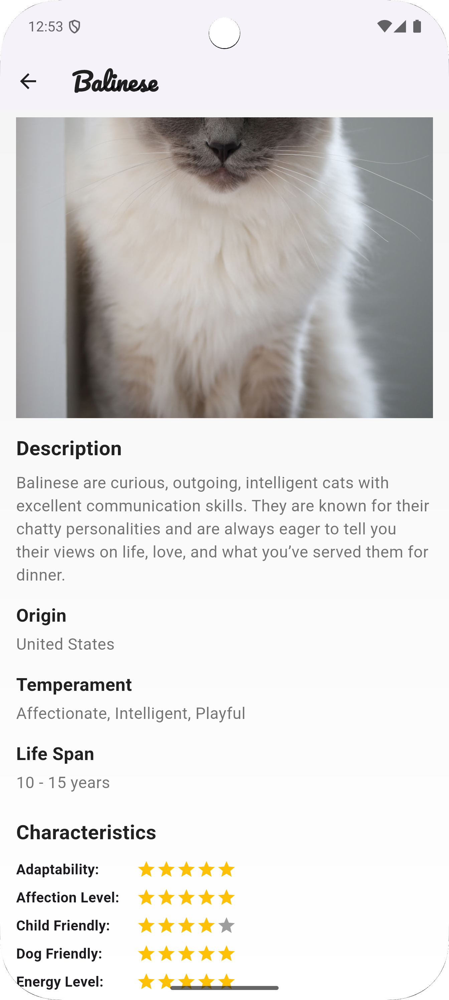
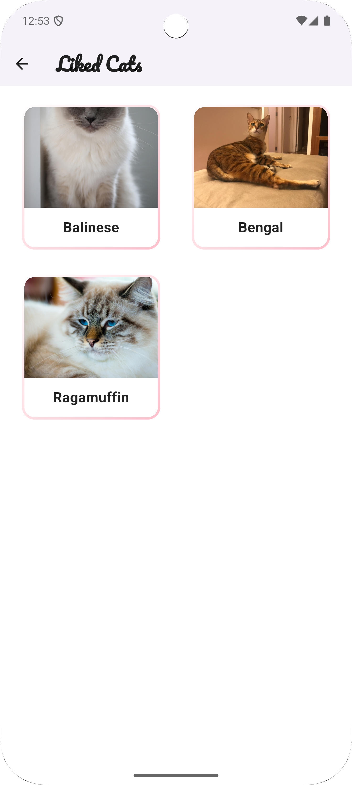

# Cat Swiper

Cat Swiper — это кроссплатформенное Flutter-приложение, позволяющее просматривать случайные изображения котиков с информацией о породе, свайпать их влево или вправо для дизлайка/лайка, а также просматривать детальную информацию о котиках и галерею лайкнутых котов.

## Описание проекта

Cat Swiper создан для демонстрации возможностей Flutter и современных подходов к разработке мобильных приложений. Приложение использует [TheCatAPI](https://thecatapi.com) для получения случайных изображений котиков, но выводит только те, у которых имеется информация о породе. Пользователь может лайкать и дизлайкать изображения, просматривать подробную информацию о породе, а также открывать галерею с понравившимися котиками.

## Реализованные фичи

- **Случайные изображения котиков:** Получение изображений через endpoint `/v1/images/search?has_breeds=1`.
- **Кнопки лайка/дизлайка:** Отдельные компоненты, реализованные как StatelessWidget.
- **Детальный экран:** При нажатии на изображение открывается экран с детальной информацией о породе, описанием и характеристиками.
- **Галерея лайкнутых котов:** Нажатием на кнопку в AppBar открывается галерея с лайкнутыми котиками.
- **Отображение даты лайка:** Для каждого лайкнутого котика отображается дата и время добавления в избранное.
- **Удаление из избранного:** Возможность удалить котика из списка лайкнутых.
- **Фильтрация по породе:** Выпадающий список для фильтрации лайкнутых котиков по породе.
- **Обработка ошибок сети:** Диалоговые окна с информацией об ошибках и возможностью повторить запрос.
- **Индикаторы загрузки:** Отображение CircularProgressIndicator при загрузке изображений и данных.
- **Кастомный дизайн:** Минималистичный, футуристичный стиль с использованием кастомных иконок, градиентных фонов, дизайнерского шрифта и уникальных элементов оформления.
- **State Management:** Используется Provider для управления состоянием приложения.
- **Dependency Injection:** Использование get_it для внедрения зависимостей.
- **Чистая архитектура:** Разделение на слои Data, Domain и Presentation.
- **Оффлайн-режим:** Приложение полностью функционирует без доступа к интернету, отображая ранее загруженных котиков.
- **Кэширование изображений:** Все изображения кэшируются и доступны без сети.
- **Индикация состояния сети:** Неблокирующее уведомление о работе в оффлайн-режиме.
- **Сохранение данных:** Лайки и дизлайки сохраняются между сеансами использования приложения.

## Скриншоты интерфейса

  
*Главный экран с отображением случайного котика и кнопками для свайпа.*

  
*Детальный экран с информацией о породе котика.*

  
*Галерея лайкнутых котиков.*

  
*Работа приложения в оффлайн-режиме с уведомлением о состоянии сети.*

## Ссылка на APK

Скачайте актуальную версию APK:  
[Cat Swiper APK](https://github.com/Amumax/cat_swiper/releases/download/main/app-release.apk)

## Установка и запуск

1. **Клонируйте репозиторий:**

   ```bash
   git clone https://github.com/Amumax/cat_swiper.git
   ```

2. **Установите зависимости:**

   ```bash
   flutter pub get
   ```

3. **Запустите приложение:**

   ```bash
   flutter run
   ```

## Технические детали

- **Flutter & Dart:** Приложение разработано с использованием Flutter и языка Dart.
- **HTTP:** Для запросов к [TheCatAPI](https://thecatapi.com) используется пакет http.
- **CachedNetworkImage:** Для загрузки и кэширования изображений с настроенным периодом хранения.
- **Provider:** Для управления состоянием приложения.
- **Get_it:** Для внедрения зависимостей и реализации DI.
- **Intl:** Для форматирования дат и времени.
- **Drift:** Для работы с локальной SQLite базой данных.
- **SharedPreferences:** Для хранения настроек и счетчиков.
- **Connectivity Plus:** Для отслеживания состояния сетевого подключения.
- **Архитектура:** Приложение построено с использованием принципов чистой архитектуры с разделением на слои.
- **Unit-тесты:** Написаны тесты для проверки функциональности лайков/дизлайков с использованием mockito.
- **Кастомные ассеты:** Приложение использует собственные изображения для иконок и фона, расположенные в папке `assets/`.
